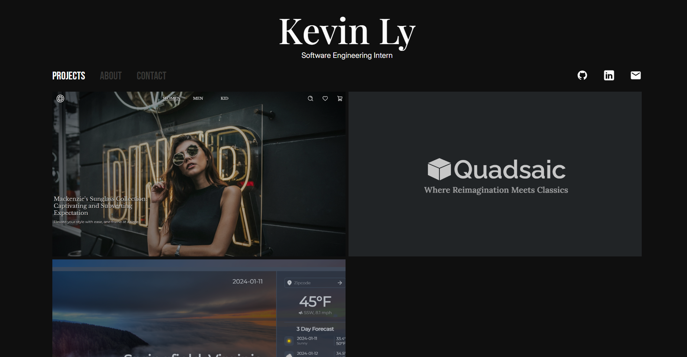

# PortfolioV3
This repository showcases my projects and skills as a web developer

## Table of Contents
- [Access](#Access)
- [Installation](#installation)
- [Tools](#tools)
- [Project Structure](#project-structure)
- [Style Guide](#style-guide)
- [Screenshots](#Screenshots)
- [License](#license)

## Access
Accessible from 

## Installation
1. **Clone the repository:**
    ```bash
    git clone 
    cd Portfolio
    ```
2. **Install dependencies:**
    ```bash
    npm i
    ```
3. **Build and Start the server:**
    ```bash
    npm run build
    npm run preview
    ```
4. **Access the application:**
Open your browser and go to localhost

## Tools
- React
- JS
- CSS
- Figma

## Project Structure
```
├── public/                 # Static Files
│   ├── ProjectImages/      # All project screenshot
├── src/                    # Source folder
│   ├── components/          # Contains all react component
│   │   ├── Layout/         # Layout components e.g header, nav, etc
│   │   ├── svg/            # SVG icons and illustrations
│   │   ├── utilities/      # Smaller components
│   ├── data/               # JSON file location
│   ├── Style/              # CSS file location
│   ├── App.jsx             # Application
│   ├── main.jsx            # Entry point
├── index.html              # Starting html file
├── .gitignore              # Git ignore file
└── package.json            # Project metadata and dependencies
```

## Style Guide


## Screenshots


## License
Distributed under the MIT License. See `LICENSE` for more information.